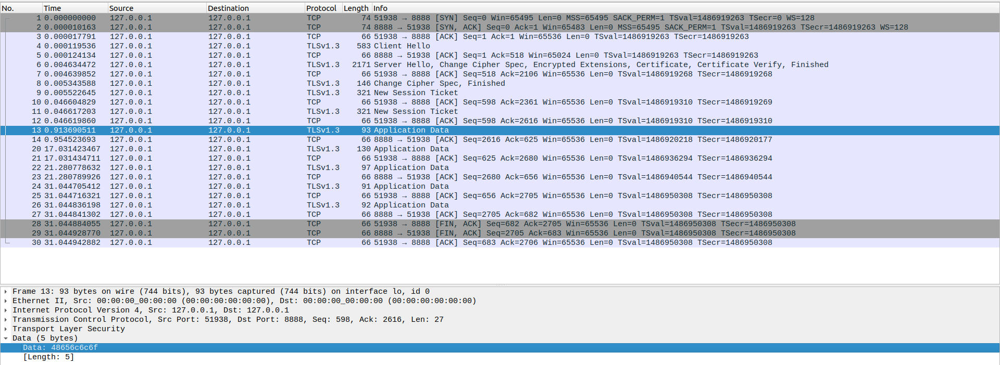

# Простое клиент-серверное приложение, использующее TCP с TLS слоем

## Запуск

Для запуска сервера необходимо выполнить `python server.py` с указанием сертификата (флаг `--cert`) и ключа (флаг `--key`). Для клиента аналогично выполнить `python client.py`, но без указания ключа. Для завершения работы клиента необходимо написать exit во время прослушивания сервером. Пока ответ от сервера не получен, писать сообщения нельзя.

## Пример работы

Если запустить клиент и сервер с одинаковыми сертификатами, то приложение будет работать корректно. Запись трафика можно посмотреть в [файле](Results/TCP_TLS_SAME_CERTS.pcapng). Там же присутствуют [логи ключей](Results/keylog.txt) для того запуска. Если указать их в Wireshark, то можно увидеть содержимое сообщений (правда перевод в буквы всё ещё нужно сделать самостоятельно, в примере просто можно использовать любой ASCII декодер и получить первое сообщение - `Hello`).

Если сертификаты будут отличаться, то программа выдаст исключение и завершится. Сетевую трассу можно посмотреть [тут](Results/TCP_TLS_WRONG_CERT.pcapng).
