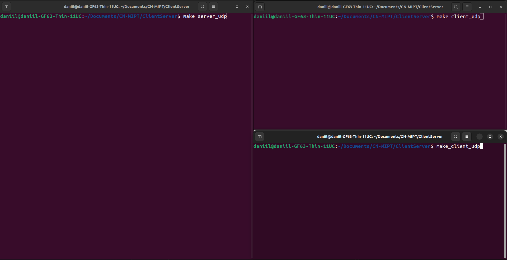
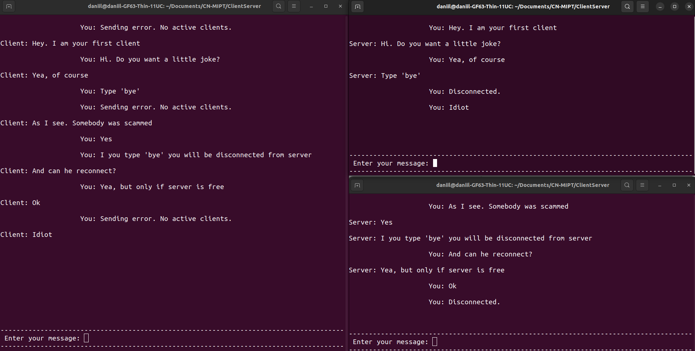

# Мессенджер

---

## О проекте

Проект представляет из себя простой консольный мессенджер. Для корректной работы необходимо запустить сервер и один или несколько клиентов (см. **Компиляция и запуск**), работающих с одинаковыми протоколами передачи данных. На данный момент поддерживаются два протокола: *TCP* и *UDP*. При использовании разных протоколов, тот, что работает на *TCP* будет ожидать другого *TCP* подключения и связи не состоится.

---

## Компиляция и запуск

Для компиляции программы на компьютере должен быть установлен пакет `ncurses`.

Перед запуском приложения необходимо вызвать `make`, и затем одну из следующих команд:

- `make server_tcp` - для запуска *tcp* сервера
- `make server_udp` - для запуска *udp* сервера
- `make client_tcp` - для запуска *tcp* клиента
- `make client_udp` - для запуска *udp* клиента

**Важно:** запуск двух серверов не допускается, так как для сервера используется заранее определённый порт и при попытке запустить второй сервер, не получится создать сокет. Ошибка скорей всего не высветится в силу того, что консолью управляет пакет `ncurses`.

---

## Пример работы

Приведём два примера работы мессенджера (для разных протоколов).

Проанализируем их в самом конце, так как особо различий не будет.

1. *UDP*
    - Для начала запустим клиент и два сервера:
    
    - Напишем несколько сообщений
    
    - Посмотрим на трассу
    
2. *TCP*
    - Также запустим клиент и два сервера:
    
    - Напишем похожие сообщения
    
    - И посмотрим на трассу
    

Итак, что мы видим. В самом начале у сервера нет никакого клиента и соответственно любая попытка отправить сообщение с сервера приведёт к ошибке: `Нет активных клиентов`. Первый написавший что-либо на сервер становится текущим клиентом (в *tcp* трассе можем видеть установку соединения тройным рукопожатием, в *udp* сервер просто запоминает адрес).

Теперь клиент может общаться с сервером и никто другой не сможет написать на сервер, так как его сообщения будут игнорироваться в силу несовпадения портов. После отправки активным клиентом сообщения `bye` происходит разрыв соединения. В случае `tcp` проводится стандартная процедура закрытия сессии, а в случае `udp` просто сервер готов не игнорировать сообщения от клиентов, чей адрес не совпадает с активным (ведь его больше нет).

После этого процедура повторяется со вторым клиентом.

---

## Итог

Вот так, небольшой мессенджер демонстрирует применение интерфейса сокетов для реализации общения посредством двух популярных протоколов. Сетевые трассы с этих примеров доступны в папке  [resources](Resources/). Также, они дублируются ниже:

[UDP трасса](Resources/UDP_messenger.pcap)
[TCP трасса](Resources/TCP_messenger.pcap)
